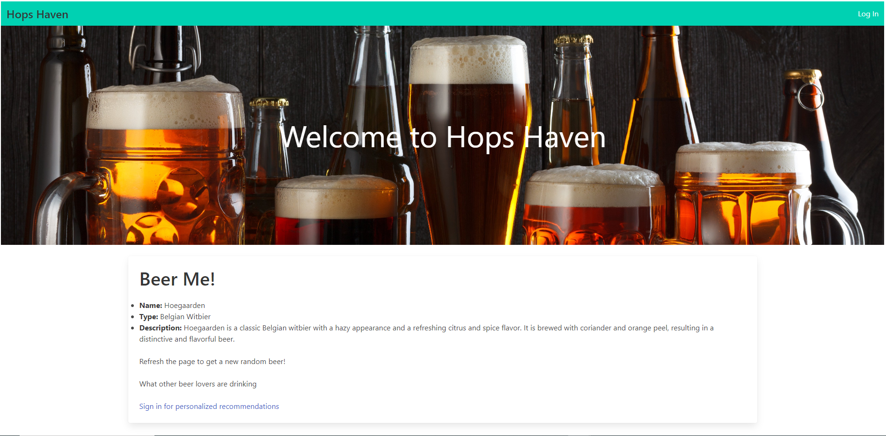

# Hops-Haven

Hops-Haven is a full-stack web application that beer enthusiasts can use to find data on the beers they love and discover new beers they might enjoy. Our team collaborated to plan the architecture and technologies for the application, following the MVC (Model-View-Controller) paradigm. We chose to use Handlebar for the frontend, Node.js for the backend, and Sequelize as our database, all of which allowed us to build a scalable and maintainable application that met our client's needs.



## Description

Our application provides users with an intuitive and user-friendly interface that makes it easy to browse and search for information about beers. Whether you're someone who's just getting into beer or a seasoned enthusiast, Hops-Haven is designed to be accessible to everyone.

We started building the application by creating the backend and developing an API that could handle all the requests sent from the frontend. We defined the routes, set up the database connection, and implemented user authentication using JSON Web Tokens (JWT) to ensure that only authorized users could access certain parts of the application.

Next, we built the frontend using Handlebar. We defined the components and views and integrated them with the backend API, making sure that the user interface was responsive, user-friendly, and accessible.

Finally, we connected the frontend with the backend, making API calls to fetch and display data in real-time. We also made sure that the data persisted in the database by creating the necessary models, controllers, and services.

Overall, we believe that beer enthusiasts will love using Hops-Haven to find data on the beer they like and discover new beers they might enjoy. Our application is designed to be easy to use, highly functional, and secure, with robust user authentication and encryption features that help to protect users' personal information and data.

---

## Languages and Technologies Used

[](https://skillicons.dev)

| Featured Technology Used |                     Link                     |
| :----------------------: | :------------------------------------------: |
|       `JavaScript`       |    [LINK](https://devdocs.io/javascript/)    |
|        `Node.js`         |        [LINK](https://nodejs.dev/en/)        |
|          `Git`           |         [LINK](https://git-scm.com/)         |
|          `NPM`           |        [LINK](https://www.npmjs.com/)        |
|         `Mysql`          |        [LINK](https://www.mysql.com/)        |
|       `Sequelize`        |        [LINK](https://sequelize.org/)        |
|        `Express`         |        [LINK](https://expressjs.com/)        |
|         `Heroku`         |    [LINK](https://devcenter.heroku.com/)     |
|         `dotenv`         | [LINK](https://www.npmjs.com/package/dotenv) |
|       `Handlebars`       |      [LINK](https://handlebarsjs.com/)       |
|        `Insomnia`        |        [LINK](https://insomnia.rest/)        |
|        `Punk API`        |         [LINK](https://punkapi.com/)         |
|         `Bulma`          |          [LINK](https://bulma.io/)           |

---

|   Collaborators    |                                                                                                                                  Socials                                                                                                                                   |
| :----------------: | :------------------------------------------------------------------------------------------------------------------------------------------------------------------------------------------------------------------------------------------------------------------------: |
|    `Noah Hoang`    | [](https://github.com/codenamenoah) [](https://www.linkedin.com/in/codenamenoah/) [](https://twitter.com/CodeNameNoahH) |
|  `Cassie Tepper`   |                                               [](https://github.com/CTep09) [](https://www.linkedin.com/in/cassie-tepper/)                                                |
| `Afi Nhkume-Crecy` |                                        [](https://github.com/AFICRECY) [](https://www.linkedin.com/in/afi-nkhume-crecy-932862128/)                                        |
| `Tamara Dusenbury` |                                       [](https://github.com/tdusenbury) [](https://www.linkedin.com/in/tamara-dusenbury-02ab8591/)                                        |

## Take A Look At Our Application!

Deployed Application Link on Heroku [Hops Haven](https://hops-haven.herokuapp.com/)


---

<p>&nbsp;</p>

## Table of Contents:

- Installation (JavaScript, Node.js, NPM Packages, Template Literals, Arrow Functions, Objects, and Functions,SQL, Sequelize, Dotenv, Express.js, Heroku, Handlebars)
- Usage
- Credits
- License

<p>&nbsp;</p>

### Installation:

**To Clone Our Repository Using CLI**

1. Click on the green code button and copy the link for the SSH key.
2. Once clip-boarded load up a command line interface and change directory to one of your preference
3. Enter in the command `git@github.com:CodeNameNoah/Hops-Haven.git`
4. Enter your protected SSH password

**To Download Our Repository as a ZIP File**

1. Click on the green code button
2. In the bottom of the drop-down menu, click Download Zip


Have you ever wanted to search through a listing of Beers to find exactly what you're looking for? Our team decided on creating a web application that contained an expansive back catalog of beer types and descriptions utilizing a Web API and Sequelize databases. Using the Punk API, we were able to incorporate their database into our own application. Punk API is a free open public domain beer database & schema for use in any (programming) language (e.g. uses plain text data sets). To install this project, a knowledge of HTML, CSS, JavaScript, Web API’s, and Server Side API, Node.js, and Express.js, SQL, Sequelize, Handlebars, and Heroku were required. Methods used ranged from functions, document window methods, querySelector, getElementById, Event Listeners, Variables, If/Else Statements, and the Punk API link and key.

The web application is intended for the user to be able to enter our website, initially land on the Homepage which will give them options to sign in and create an account, or login if they are already a member. Once they do this they will enter the user personalized dashboard which includes a search bar for the user to enter the word “beer” to get all beers, or a beer name or type in order to pull from the Punk API’s database. The user can then select and remove from either their beer “Favorites List”, “Beers to Try”, and upon refresh are able to see a randomly suggested beer and type. We installed the following dependencies with my npm install (bcrypt, dotenv, express-handlebars, mysql2, and sequelize). Bcrypt was used for password hashing, and express-handlebars that uses a template and an input object to generate HTML. When the template is executed, these expressions are replaced with values from an input object. Lastly, we utilized local storage to enable the user data like "Favorite Beer" and "Beers to Try" to persist to the screen upon refresh. The code below makes this happen.

<p>&nbsp;</p>

### Server.js

```js
const sess = {
  secret: "Super super secret",
  cookie: {
    maxAge: 3600000,
  },
  resave: false,
  saveUninitialized: false,
  store: new SequelizeStore({
    db: sequelize,
  }),
};

app.use(session(sess));

const hbs = exphbs.create();

app.engine("handlebars", hbs.engine);
app.set("view engine", "handlebars");

app.use(express.json());
app.use(express.urlencoded({ extended: true }));
app.use(express.static(path.join(__dirname, "public")));
app.use(routes);

sequelize.sync({ force: false }).then(() => {
  app.listen(PORT, () => console.log(`App listening on port ${PORT}!`));
});
```

**Server.js** sets up an Express.js server with session management using Express Session and Sequelize for session storage in a database. It configures the server to use Handlebars as the view engine, sets up middleware for parsing JSON and URL-encoded data, and serves static files. It defines application routes and syncs with the database before starting the server on a specified port.

<p>&nbsp;</p>

### Homepage Handlebars

```html
<div>
  

  <h2>Beer of the Day</h2>

  <ul>
    {{#each randomBeers as |randomBeer|}}
    <li>{{randomBeer.dataValues.name}}</li>
    {{/each}}
  </ul>

  <h3>What other beer lovers are drinking</h3>

  <a href="/login">Sign in for personalized recommendations</a>
</div>
```

The template was created with Handlebars and it displays an image, the "Beer of the Day" heading, a list of random beers, and a subheading for what other beer lovers are drinking. It also includes a link to the login page for personalized recommendations.

<p>&nbsp;</p>

### Main Handlebars

```html
<nav class="navbar is-primary" role="navigation" aria-label="main navigation">
         <div class="navbar-brand">
             <a class="navbar-item" href="/">
                 <h1 class="hero">Hops Haven</h1>
             </a>
             <a role="button" class="navbar-burger" aria-label="menu" aria-expanded="false">
                 <span aria-hidden="true"></span>
                 <span aria-hidden="true"></span>
                 <span aria-hidden="true"></span>
             </a>
         </div>

         <div class="navbar-menu">
             {{#if logged_in}}
               <div class="navbar-end">

                 <a class="navbar-item" href="/dashboard">Dashboard</a>
                 <a class="navbar-item" href="/">Logout</a>
               </div>
             {{else}}
               <div class="navbar-end">

                 <a class="navbar-item" href="/login">Log In</a>
               </div>
             {{/if}}

         </div>
       </nav>

        <div class="hero-image">
       <h1 class="hero-text">Welcome to Hops Haven</h1>
   </div>

     <main class="container container-fluid mt-5">

       {{{body}}}
     </main>
     <footer>

     </footer>
   </div>

   {{#if logged_in}}
     <script src="/js/logout.js"></script>
   {{/if}}
 </body>
```

This Handlebars HTML code creates a responsive navigation bar and a hero image section welcoming users to "Hops Haven," that will be consistent across the Hops Haven website. It includes conditional blocks to render different navigation options based on the user's login status and loads a JavaScript file for logout functionality when logged in.

<p>&nbsp;</p>

## Authentication JS

```js
const withAuth = (req, res, next) => {
  if (!req.session.logged_in) {
    res.redirect("/login");
  } else {
    next();
  }
};
module.exports = withAuth;
```

This is a middleware function that checks if the user if logged in or not. If the user is not logged in, they will be redirected to the login page. If the user is logged in then it calls the next() function to proceed with the next step.

<p>&nbsp;</p>

## Beer Seeds JSON

```json
{
   "name": "Stella Artois",
   "type": "Pilsner",
   "description": "Stella Artois is a Belgian pilsner with a smooth and slightly bitter taste. It is known for its distinctive golden color and floral aroma."
 },
```

Beer seeds were created to facilitate testing, development, demonstration, data modeling, and performance evaluation of Hops Haven, leading to better functionality, improved user experience, and efficient data handling.

<p>&nbsp;</p>

Beer Model

```js
class Beer extends Model {}
Beer.init(
  {
    id: {
      type: DataTypes.INTEGER,
      allowNull: false,
      primaryKey: true,
      autoIncrement: true,
    },
    name: {
      type: DataTypes.STRING,
      allowNull: false,
    },
    type: {
      type: DataTypes.STRING,
      allowNull: false,
    },
    description: {
      type: DataTypes.STRING,
      allowNull: false,
    },
  },
  {
    sequelize,
    timestamps: false,
    freezeTableName: true,
    underscored: true,
    modelName: "beer",
  }
);

module.exports = Beer;
```

This code defines a Beer model using Sequelize. The Beer model extends the Model class and includes properties such as `id`, `name`, `type`, and `description`. The Beer model is exported to be used in other parts of the project. This code defines the Beer model and enables seamless interaction with beer data.

<p>&nbsp;</p>

Homeroutes JS

```js
function generateRandomNumbers(min, max, count) {
  if (max - min + 1 < count) {
    throw new Error(
      "Range is smaller than the desired count of random numbers."
    );
  }
  const result = [];
  const numbers = new Set();
  while (result.length < count) {
    const randomNumber = Math.floor(Math.random() * (max - min + 1)) + min;
    if (!numbers.has(randomNumber)) {
      numbers.add(randomNumber);
      result.push(randomNumber);
    }
  }
  return result;
}

router.get("/", async (req, res) => {
  try {
    const allBeers = await Beer.findAll();

    const numOfBeers = allBeers.length;

    const randomBeersIDs = generateRandomNumbers(1, numOfBeers, 3);

    const randomBeers = [];
    for (let i = 0; i < 3; i++) {
      const beerData = await Beer.findByPk(randomBeersIDs[i]);
      randomBeers.push(beerData);
    }

    console.log(randomBeers);

    res.render("homepage", {
      randomBeers,
      logged_in: req.session.logged_in,
    });
  } catch (err) {
    res.status(500).json(err);
  }
});

router.get("/login", (req, res) => {
  if (req.session.logged_in) {
    res.redirect("/");
    return;
  }
  res.render("login");
});

router.get("/signup", (req, res) => {
  if (req.session.logged_in) {
    res.redirect("/");
    return;
  }
  res.render("signup");
});
```

This code is handles the routes for a Hops Haven. It has a cool function called generateRandomNumbers that generates unique random numbers within a given range. The main route, '/', is responsible for retrieving beer data from a database and displaying it on the homepage. It picks three random beer IDs, fetches their data, and sends it to the rendered view. If the user already logged in, the /login and /signup routes will redirect them to the homepage. However, if the user is not logged in, it will show the login and signup pages.

<p>&nbsp;</p>

User Routes JS

```js
router.post("/login", async (req, res) => {
  try {
    const newUser = await User.findOne({
      where: {
        username: req.body.username,
      },
    });

    if (!newUser) {
      res.status(400).json({
        message: "Username or Password is incorrect, please try again.",
      });
      return;
    }

    const loginPw = newUser.checkPassword(req.body.password);

    if (!loginPw) {
      res.status(400).json({
        message: "Username or Password is incorrect, please try again.",
      });
      return;
    }

    req.session.save(() => {
      req.session.userId = newUser.id;
      req.session.username = newUser.username;
      req.session.logged_in = true;

      res.status(200).json({ user: newUser, message: "You are logged in!" });
    });
  } catch (err) {
    console.log(err);
    res.status(500).json(err);
  }
});
router.post("/logout", (req, res) => {
  if (req.session.logged_in) {
    req.session.destroy(() => {
      res.status(204).end();
    });
  } else {
    res.status(404).end();
  }
});

module.exports = router;
```

This User route handles user login and logout functionality. he /login route is responsible for validating user credentials by checking if the provided username exists in the database and comparing the password. If the username or password is incorrect, it returns an appropriate error message. If the login is successful, it saves the user's session data, indicating that they are logged in.

<p>&nbsp;</p>

### Usage:

By using a website that has access to a beer API like Punk API, you can easily find and discover new beers that match your preferences. With the ability to search through a vast catalog of beer types and descriptions, you can quickly locate beers that match your preferred style, taste, and even a description with more information about the particular beer. This can be particularly useful if you're a beer enthusiast who wants to stay up-to-date with the latest beer releases and trends. Ultimately, our web application allows access to a beer API that provides users with a comprehensive resource for exploring the world of beer and discovering new and exciting options.

<p>&nbsp;</p>

## Credits

- Express Installation: https://expressjs.com/en/starter/installing.html
- Express API: https://expressjs.com/en/api.html
- GET & POST Requests: https://www.diffen.com/difference/GET-vs-POST-HTTP-Requests
- Error Help: https://stackoverflow.com/questions/14949118/node-js-error-cannot-find-module-express
- Express Routing Guide: https://expressjs.com/en/guide/routing.html
- Error in Sequelize: https://stackoverflow.com/questions/61515940/error-in-sequelize-name-sequelizeeagerloadingerror
- Express Middleware: https://expressjs.com/en/guide/using-middleware.html
- Connect Session: https://www.npmjs.com/package/connect-session-sequelize
- Express-Handlebars: https://www.npmjs.com/package/express-handlebars
- Built-in Handlebars Helpers: https://handlebarsjs.com/guide/builtin-helpers.html#unless
- Handlebars training: https://www.youtube.com/watch?v=zT_cGPnl-pw
- MYSQL2 NPM: https://www.npmjs.com/package/mysql2
- Bulma CSS Styling: https://bulma.io/documentation/
- Bcrypt Password Hashing: https://www.geeksforgeeks.org/how-to-use-bcrypt-for-hashing-passwords-in-php/
- API Keys: https://www.learnhowtoprogram.com/intermediate-javascript/asynchrony-and-apis/api-documentation-and-keys
- Punk API: https://punkapi.com/
- GreenSock Animation Platform: https://greensock.com/gsap/ 

### License:

MIT License

Copyright (c) [2023] [Afi Nkhume-Crecy, Noah Hoang, Cassie Tepper, Tamara Dusenbury]

Permission is hereby granted, free of charge, to any person obtaining a copy
of this software and associated documentation files (the "Software"), to deal
in the Software without restriction, including without limitation the rights
to use, copy, modify, merge, publish, distribute, sublicense, and/or sell
copies of the Software, and to permit persons to whom the Software is
furnished to do so, subject to the following conditions:

The above copyright notice and this permission notice shall be included in all
copies or substantial portions of the Software.

THE SOFTWARE IS PROVIDED "AS IS", WITHOUT WARRANTY OF ANY KIND, EXPRESS OR
IMPLIED, INCLUDING BUT NOT LIMITED TO THE WARRANTIES OF MERCHANTABILITY,

---
